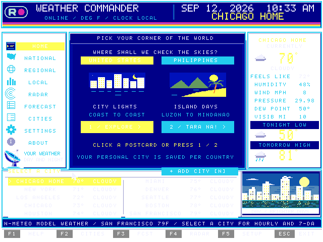

# WEATHER COMMANDER

A native **Prog8 weather station for the Commander X16**, with your RODDY logo,
a resident cable-weather shell, and sixteen independently compiled content,
network, and data banks. Current weather, hourly and seven-day forecasts,
regional comparisons, city statistics, and NOAA/PAGASA radar use online data.
Without usable data it starts in the clearly labeled demo.



## Download for your X16

Get [the latest release](https://github.com/lionsarmor/WEATHER-COMMANDER/releases/latest).
Extract **WEATHER-COMMANDER-X16.zip** and copy its entire **WEATHER** folder to
your SD card. It contains all 58 required PRG/BIN files and `START-HERE.TXT`.
For live data, download the separate **WEATHER-COMMANDER-BRIDGE.zip** for your
computer. The X16 works in its labeled demo without the bridge.

On this development computer, build both downloads from any directory with:

```sh
buildweather
```

The files appear in this project's `dist/` folder. `buildweather --check` also
runs the full compiled and backend tests. From a fresh checkout, use `./buildweather`.

## Launch

```sh
WEATHERCMD
```

The shortcut builds changed files, starts the host weather bridge, and launches
the emulator. New Bash terminals load the alias automatically; use
`source ~/.bash_aliases` in an existing terminal. The emulator uses your
computer's Internet connection. The bridge stops when the emulator closes.

On the dashboard, open **Settings → Wi-Fi and connections**. Choose **On this
computer** for emulator use, or **On a real Commander X16** for the guided
network → password → weather setup. For a physical X16, start `./bridge.sh`
on your computer and enter the address it prints. A bare IP is accepted; the
app supplies `http://` and port `8767`. **Save and open weather** finishes setup. Other clickable settings cover units, refresh interval, auto
refresh, data source, home city, and saved preferences. Chicago is the initial
home station; select another city and use Settings → Use selected city as home.

Click **+ ADD CITY [N]** beside **SELECT A CITY**, or press **N**. Enter a city
and optional state/country (for example, `Madison, WI`), then click **SEARCH CITY**.
Choose the matching location to load its weather and put it first in the list,
alongside the nine standard cities. The choice is saved automatically by the
weather bridge and restored on the next launch. Adding another city replaces
this personal city. Failed lookups preserve the current city and weather.
City search needs the running weather bridge and an Internet connection.

[USA and Philippines maps](docs/maps-preview.png) ·
[Wi-Fi setup preview](docs/wifi.png) · [Radar preview](docs/radar.png) ·
[Forecast preview](docs/forecast.png) ·
[Hourly chart](docs/hourly.png) · [Settings preview](docs/settings.png) ·
[Add city](docs/add-city.png) · [Personal city in the list](docs/city-added.png) ·
[All 28 landscapes](docs/scenery.png)

[Full interface preview](docs/interface-preview.png): card headers, buttons,
tabs, input fields, and selected rows use centered text with consistent padding.

## Build and run manually

```sh
python3 -m venv .venv
source .venv/bin/activate
python3 -m pip install -r requirements-dev.txt
make
./run.sh --no-build
```

For a standalone checkout, install Java 21 or newer, curl, unzip, make and a C
compiler, then run `./tools/setup-toolchain.sh`. It downloads checksum-verified
Prog8 12.3.2 and 64tass 1.60.3243 into `.tools/`. For emulator launch, also place
the r49 emulator and its `rom.bin` in `.tools/x16emu/`.

Until a local toolchain is installed, the build reuses the DESK COMMANDER toolchain at
`~/Desktop/Roddy Software/DESK COMMANDER/.tools` without changing that project.
`X16_TOOLS` can select another directory containing `jre/bin/java`,
`prog8/prog8c-12.3.2-all.jar`, `bin/64tass`, and `x16emu/{x16emu,rom.bin}`.
The tested emulator/ROM is r49. Use at least 512 KB banked RAM.

Copy all release PRG/BIN files to one directory on device 8 for a physical X16:

```basic
DOS "CD:WEATHER"
LOAD "WEATHER.PRG",8
RUN
```

See [host bridge and physical Wi-Fi setup](docs/HOST-BRIDGE.md). Physical Wi-Fi
uses the TexElec/ZiModem protocol adapted from DESK COMMANDER; its driver,
setup screen, weather provider, and radar loader each have their own bank.
Hardware still needs an actual card test. No existing DESK service was changed
or deployed.

## Controls

| Input | Action |
|---|---|
| Up / Down, Tab | Select a sidebar section |
| Left / Right | Select a city |
| Enter | Selected city's local weather |
| Mouse | Click sidebar, footer shortcuts, map stations, city rows, forecast tabs, settings and Wi-Fi controls |
| Click scenery / G | Next landscape (also rotates every 30 seconds) |
| F1 / F2 / F3 / F4 / F5 | Help / Cities / Forecast / Radar / Settings |
| F in Forecast | Switch seven-day / hourly chart |
| R / H / Esc | Refresh / Home / Exit (Back inside Wi-Fi) |
| Settings: W / U / T / A / D | Wi-Fi / units / interval / auto / data source |
| Settings: C / S | Use selected city as home / save preferences |
| Wi-Fi: Tab / Enter | Select field / continue |
| Wi-Fi: 1 / 2 on welcome | Computer connection / X16 Wi-Fi modem |
| Wi-Fi: Enter / Esc / X | Continue / previous step / close (X outside fields) |

Home uses a cyan-and-gold retro destination-board icon and opens the country picker:
click the USA skyline or the Philippines island
postcard, or press **1 / 2**. National shows that country's map; Regional compares
US stations or Luzon, Visayas and Mindanao. Each country remembers its personal
city. Switching countries requires the weather bridge and an Internet connection.
Philippine weather, forecasts and PAGASA radar are supported. US radar is never
displayed on the Philippines map. Both National maps use bright green land,
blue ocean scanlines, large colorful weather symbols and compact yellow temperatures.
The Philippine archipelago also remains visible when radar is unavailable.

The header centers larger pixel lettering for a 12-hour local clock above the selected city and country,
with a gold location line and the station's rainbow accent stripe. Connection
status and temperature units sit beneath the station title.

## Data and graphics

[Open-Meteo](https://open-meteo.com/en/docs) supplies current **model** weather
and forecasts; [NOAA/NWS](https://mapservices.weather.noaa.gov/eventdriven/rest/services/radar/radar_base_reflectivity_time/ImageServer) supplies the
US national base-reflectivity radar. The radar uses a crisp native map with a
geographically aligned, transparent echo layer and its own intensity legend.
Weather is cached for ten minutes and radar for five;
the app checks for updates every minute by default. City screens show the
provider's local time. Radar is a national overview; its simplified colors show relative echo intensity.
[PAGASA/Panahon](https://www.pagasa.dost.gov.ph/radar) supplies the Philippine
mosaic rain-rate raster, mapped from its published geographic bounds onto the
island geography. Its encoded values are decoded as millimetres per hour.

Without a fresh radar feed, the app shows a bundled **RADAR DEMO / NOT LIVE**
recorded sample for the selected country. These are actual captured examples,
not current conditions. After connecting, a validated fresh feed automatically
replaces the demo, displays **LIVE FEED**, and shows its observation time.
Wi-Fi setup reports radar's live/demo status separately from weather readiness.
US observations older than 15 minutes and Philippine observations older than
30 minutes fall back to the labeled demo. A connected but delayed source is
shown as **DEMO / WAITING FOR FRESH RADAR**, never as live. The network feed takes
priority over old SD files. See [sample provenance](assets/radar/NOTICE.md).

A failed update preserves previous real data with a **STALE** label.
With no usable data, AUTO uses the demo. Settings can force DEMO or select a
local snapshot. Wi-Fi passwords are masked and cleared after use; preferences
store the bridge address and display settings, not the password.

The lower-right picture rotates through city lights, country roads, an alpine
lake, palm beach, desert mesas, a lighthouse coast, and a neon highway every
30 seconds. Each has dawn, day, dusk, and night art selected by the X16's
local clock: 28 pixel postcards in separate data banks. Click the picture or press G to
advance. BRIGHTER DAYS is the reference-inspired city skyline, with a crowned
tower, gold windows, a crescent moon at night, and broken waterfront reflections.
All seven scenes use layered pixel art and palettes for each time of day.
These are decorative time bands; city sunrise/sunset comes from the
forecast provider.

The pointer is a compact white arrow with a black outline and straight vertical back;
its tip is the exact click position. City Spotlight has larger readings,
humidity bars, and direct local/forecast buttons. Click the ticker to refresh
or the top-right location banner to open Wi-Fi.

See [architecture and memory map](docs/ARCHITECTURE.md),
[wire formats](docs/SNAPSHOT.md), and [host bridge](docs/HOST-BRIDGE.md).
`build/banks.json` and `build/assets.json` report exact memory budgets.

## Validation and packaging

```sh
make check
python3 tools/smoke_emulator.py
python3 -m backend.server --once
python3 tools/smoke_emulator.py --live
python3 tools/smoke_mouse.py
make package
```

The compiled 65C02 harness covers every view, input, timer rollover, bank
restoration, live-data validation, stale/offline preservation, radar bounds,
Wi-Fi scan/join, password case and clearing, and oversized UART transfers.
Python tests cover the adapters, HTTP endpoints, cache failures, and radar
encoding. The real r49 smoke tests exercise actual ROM file I/O, rendering,
Wi-Fi without a card, preference saving, and return to BASIC. The mouse probe
uses real ROM pointer positioning with injected button edges to exercise every
screen, verify the custom sprite pixels, and capture all 28 scenery variants.

`buildweather` or `make package` creates `dist/WEATHER-COMMANDER-X16.zip`,
`dist/WEATHER-COMMANDER-BRIDGE.zip`, and `dist/SHA256SUMS.txt`. The X16 ZIP holds
one ready-to-copy `WEATHER` folder; the bridge ZIP holds a `WEATHER-BRIDGE`
folder with Python source, dependencies and setup instructions. Personal
preferences, saved locations, live snapshots and passwords are excluded.
Packaging verifies every runtime file and preserves the previous ZIP if a
required file is missing.

GitHub Actions builds and tests clean checkouts on every push. On `main`, a new
`VERSION` creates a matching `vVERSION` release with both ZIPs and checksums.
Existing releases are preserved. See [release notes](docs/RELEASE.md).
